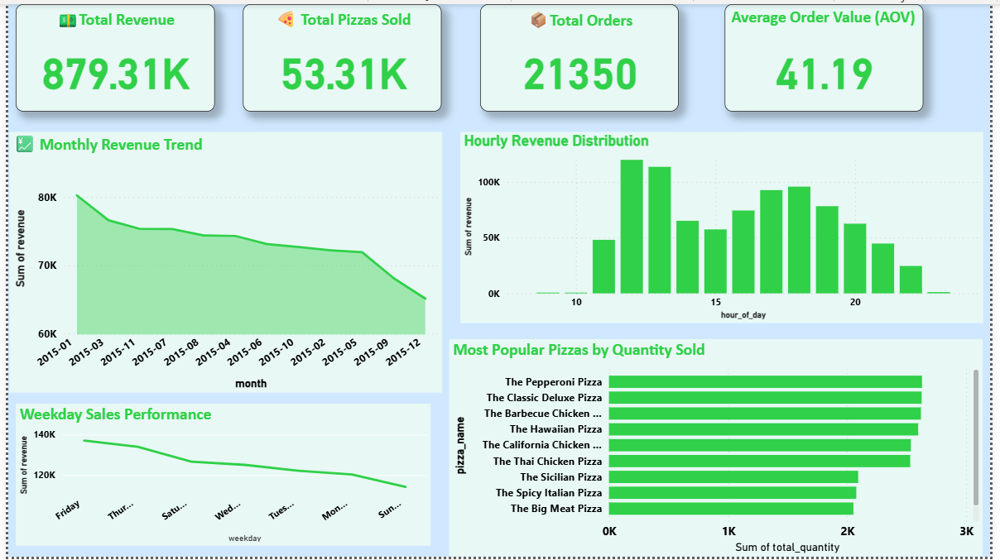
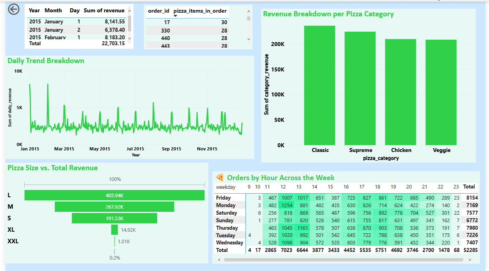

# 🍕 Pizza Sales Analysis Project

This project analyzes a fictional pizza restaurant's sales data using **SQL** for querying and **Power BI** for data visualization. It helps uncover insights into revenue, popular pizza types, order patterns, and more.

## 📊 Tools Used

- **MySQL Workbench** – SQL queries and data exploration
- **Power BI** – Dashboard and data visualization
- **Git** – Version control

## 🧠 Key Insights

- Revenue distribution by pizza **size** and **category**
- Hourly and daily **order trends**
- Top-performing pizzas based on **revenue and quantity sold**
- **Sales heatmap** by weekday and hour

## 🚀 How to Use

1. Open `pizza_sales` in MySQL Workbench to explore and run queries.
2. Open `Pizza_sale_analysis` in Power BI to view interactive insights.
3. Optional: Load the `pizza_sales.csv` data into your SQL DB or Power BI.

## 📝 Notes

- Dataset size: ~8MB (may be added to `.gitignore`)
- You can enhance this project by adding Python or Excel-based analysis

## 📌 Author

**Faisal Ijaz**  
[GitHub](https://github.com/Faisal-58) | [LinkedIn](https://www.linkedin.com/in/faisal-ijaz-44524179/)

